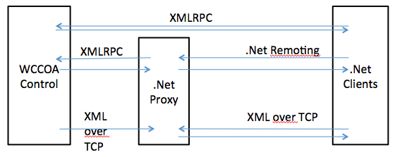

# winccoa-csharp-framework
C# Framework for WinCC OA Open Architecture connectivity (XMLRPC)

Origin "C# Framework for WinCC OA Open Architecture connectivity (XMLRPC)" from 2012. Copied from [Sourceforge](https://sourceforge.net/projects/roc-winccoa-lib/) to GitHub. 



Author: Andreas Vogler
Homepage: www.rocworks.at

Communication from .Net client to WinCC Open Architecture.

GPLv3 License is used for the public domain. 
If you plan to use it in a CLOSED SOURCE project,
please get in touch with me - andres.vogler@gmail.com !

Communication can be done directly with XMLRPC or with the included proxy:
* .net remoting is used for "commands" from the client to the proxy (dpConnect, dpQueryConnect).
* tcp (xml over tcp) for sending unsolicited data/events from the proxy to the client.

The proxy also acts as a distributor - if clients have the same dp(Query)Connects, 
the connects in the control are done once, and the proxy will forward it to the clients.

Added functions for dpConnects without using "Tag" Objects (the Tag objects where created for 
mobile clients). Now it is easy to create for example a dpQueryConnect. The callback function
is just a C# delegate:

```
// create server and client objects
client = new WCCOAClient (ProxyHost, ProxyRemotePort, ProxyClientPort);

// start and connect
client.Start ();		
client.Connect ();
Thread.Sleep (1000); // wait until client id is registered

client.DpQueryConnectSingle((object s, ArrayList a) => {
    WCCOABase.PrintArrayList(a);
    Statistics();
}, "SELECT '_online.._value', '_online.._stime' FROM '*.**'");	
```	
The proxy (WCCOANetServer.exe) must be started on a server (can, but must not be, the WCCOA Server).

Basic communication is done via XMLRPC
https://sourceforge.net/projects/roc-xmlrpc/

WinCC Open Architecture must run the included Ctrl-Script xmlnet_server.ctl

Change List:

2013.01.01: Added Proxy-Server for dp(Query)Connects. 

2012.12.23: Added a very simple C# WinForms application which displays two datapoints, waits
for value changes and values can also be set by a button out of the WinForms application.

2012.12.23: Added WaitDataMulti function which performs a dpWaitForValue. Can be used to wait 
for a change of value of data points of a taglist. 
